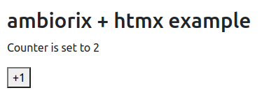
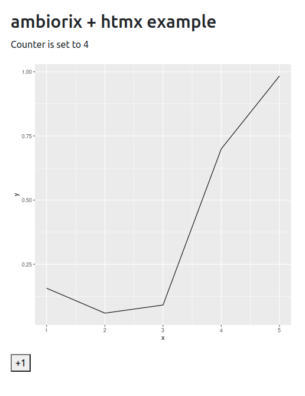
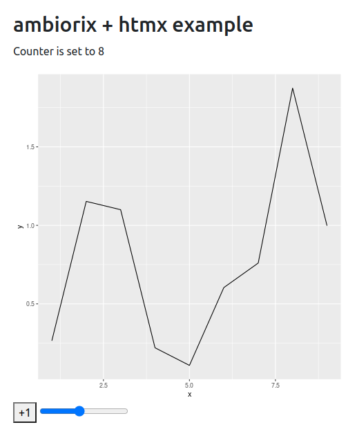
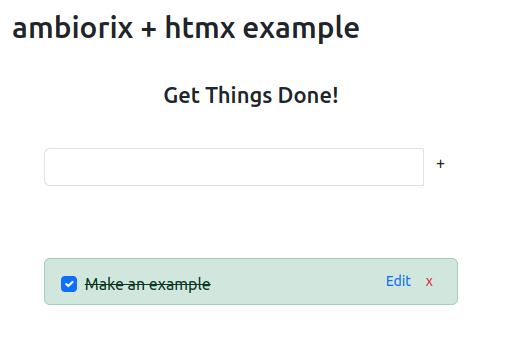

## ambhtmx

Creating an ambiorix + htmx app.

## Examples

How to run the examples:

* Clone this repository.
* Install all the prerequisites and run the examples in inst/examples folder.

### [Incrementing a counter](inst/examples/01-counter.R)

### [Updating a ggplot2](0inst/examples/02-ggplot2.R)

### [Interacting with an slider](inst/examples/03-slider.R)

### [Using SQLite to build a TODO app](inst/examples/04-todo.R)

